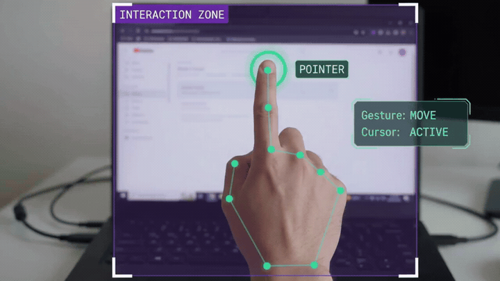
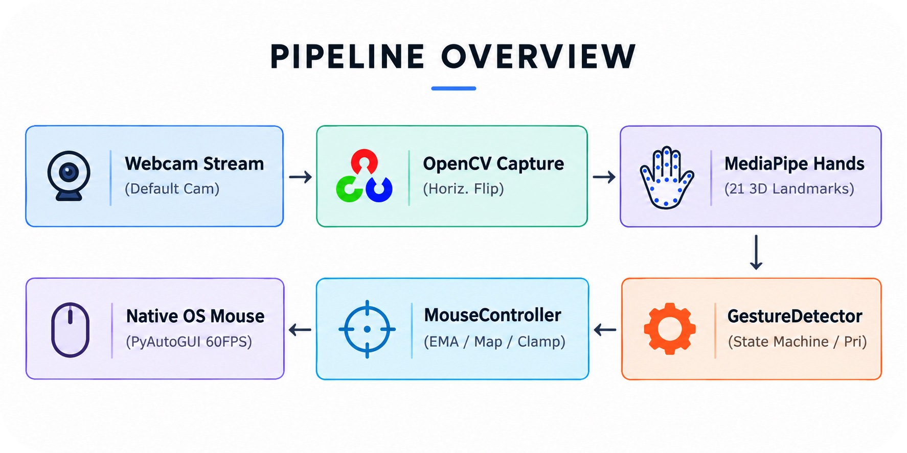
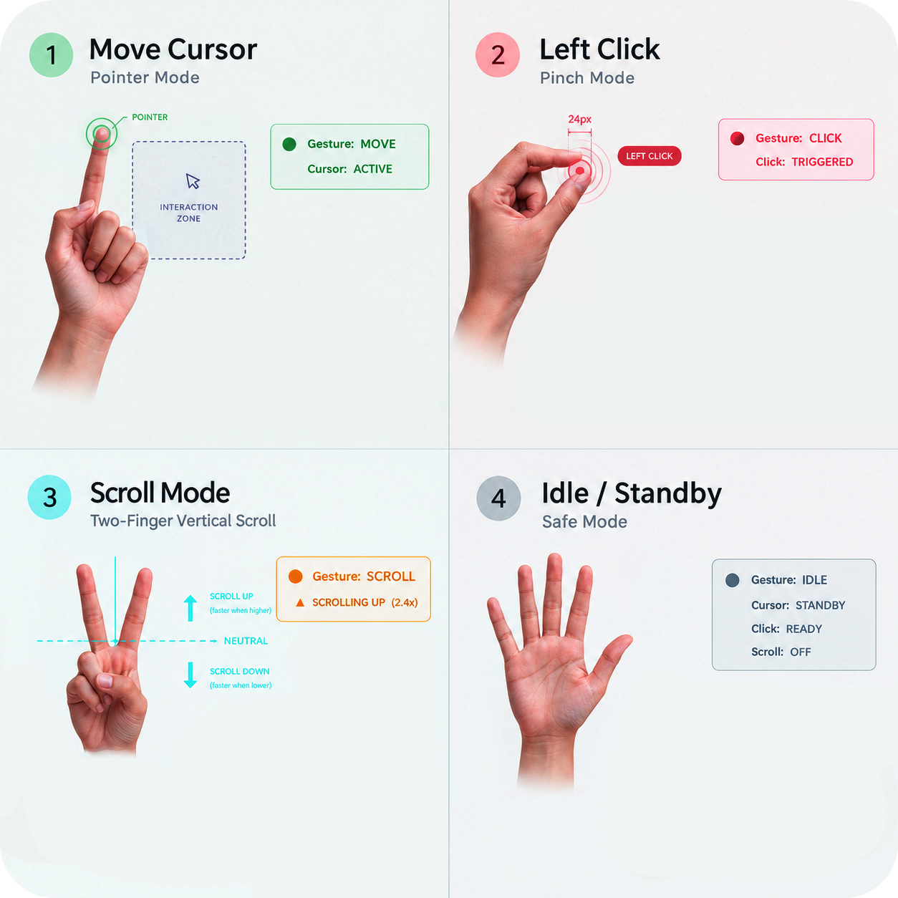

# Hand Gesture Mouse Controller

> Turn your standard webcam into a high-precision, low-latency virtual mouse using Computer Vision, Google MediaPipe, and PyAutoGUI. 

<div align="center">

[](https://www.python.org/)
[](https://opencv.org/)
[](https://developers.google.com/mediapipe)
[](https://pyautogui.readthedocs.io/)
[](LICENSE)

</div>


---

## 📸 Overview

<div align="center">
  
</div>

The **Invisible Hand Gesture Mouse Controller** transforms any standard laptop or desktop webcam into an invisible, touchless mouse interface. By tracking hand landmarks in real-time, the system classifies gestures (cursor tracking, pinch-clicking, and two-finger directional scrolling), smooths noisy camera coordinates using an **Exponential Moving Average (EMA) low-pass filter**, and dispatches native operating-system mouse events with zero perceived latency.

<br>

<div align="center"> 
   
  
</div>

## ✨ Features

- **Smooth 60 FPS Cursor Tracking**: Exponential smoothing filter eliminates webcam sensor noise and trembling while preserving responsive cursor motion.
- **Debounced Pinch-to-Click**: Euclidean distance sensing with hysteresis thresholding prevents double-click flickering and accidental repeats.
- **Two-Finger Natural Scrolling**: Intuitive vertical hand motion for webpage/document scrolling with configurable sensitivity and deadzone suppression.
- **Strict Gesture Priority Resolver**: Prevents conflicting actions (e.g., scrolling will never accidentally trigger a mouse click or cursor jump).
- **Cyber-HUD Visualization**: On-screen heads-up display showing active mode badges, cursor status, pinch distance gauge, interaction bounding box, and live FPS counter.
- **Failsafe & Zero-Lag Automation**: Sets PyAutoGUI pause to 0.0s for instant response and encapsulates PyAutoGUI `FailSafeException` gracefully.
- **Modular & Extensible Architecture**: Clean object-oriented design cleanly decoupled into tracking, gesture classification, automation, and UI modules.

---

## 🖐️ Gesture Visual Guide & Reference

<div align="center">
  
</div>

<br>

| # | Gesture & Mode | Pose | Action & Controls | HUD Visual Feedback |
| :-: | :--- | :---: | :--- | :--- |
| **1** | **Move Cursor**<br>*(Pointer Mode)* | ☝️ | Raise **index finger only**; glide fingertip within the interaction zone to steer the cursor with low-pass EMA smoothing. | `Gesture: MOVE` (Emerald)<br>`Cursor: ACTIVE` • Glowing target ring |
| **2** | **Left Click**<br>*(Pinch Mode)* | 🤏 | Pinch **thumb & index** together briefly ($< 38\text{px}$). Debounced with hysteresis ($48\text{px}$) and a $0.4\text{s}$ cooldown to prevent misclicks. | `Gesture: CLICK` (Coral Red)<br>`Click: TRIGGERED` • Expanding ripple |
| **3** | **Scroll Mode**<br>*(Vertical Scroll)* | ✌️ | Raise **index & middle** fingers. Hold **above** the cyan neutral line to scroll up, **below** to scroll down. Speed scales with distance. | `Gesture: SCROLL` (Amber/Gold)<br>Cyan `— NEUTRAL` line & dynamic rate |
| **4** | **Idle / Standby**<br>*(Safe Mode)* | ✋ / ✊ | Open full palm, rest in a fist, or remove hand from frame. Mouse actions are safely paused. | `Gesture: IDLE` (Slate)<br>`Cursor: STANDBY` • `Scroll: OFF` |


> **Priority Resolver**: In Scroll Mode, cursor movement and click triggers are strictly locked out to prevent accidental navigation or clicks while reading.

---

## 📐 Mathematical Concepts & Engineering Principles

### 1. Coordinate Space Mapping & Margin Clamping
The camera resolution (e.g. $1280 \times 720$) has a different aspect ratio and dimension than your monitor (e.g. $1920 \times 1080$ or $2560 \times 1440$). Furthermore, reaching all four corners of the webcam frame requires straining the hand out of the camera's sight.

To solve this, we define an active **Interaction Zone** inside the frame defined by margins $(M_x, M_y)$:

$$x_{\text{target}} = \text{interp}\Big(x_{\text{cam}}, [M_x, W_{\text{cam}} - M_x], [0, W_{\text{screen}} - 1]\Big)$$

$$y_{\text{target}} = \text{interp}\Big(y_{\text{cam}}, [M_y, H_{\text{cam}} - M_y], [0, H_{\text{screen}} - 1]\Big)$$

We clamp the resulting coordinates to $[0, W_{\text{screen}} - 1]$ and $[0, H_{\text{screen}} - 1]$ using `numpy.clip`, guaranteeing the cursor never overflows screen boundaries.

### 2. Euclidean Pinch Distance & Hysteresis Thresholding
The distance between the thumb tip ($P_{\text{thumb}}$) and index fingertip ($P_{\text{index}}$) in 2D pixel space is:

$$d = \sqrt{(x_{\text{index}} - x_{\text{thumb}})^2 + (y_{\text{index}} - y_{\text{thumb}})^2}$$

To prevent rapid oscillation (chattering) when fingers hover right at the boundary threshold:
- **Pinch Acquired:** $d < D_{\text{threshold}}$ (default: $38\text{ px}$)
- **Pinch Released:** $d > D_{\text{release}}$ (default: $48\text{ px}$)

This **Schmitt-trigger hysteresis band** ensures clean, confident click activations.

### 3. Dynamic Velocity-Adaptive Smoothing (1€ Filter Principles)
Raw webcam coordinate signals contain high-frequency noise caused by lighting fluctuations, sensor rolling shutter, and natural human micro-tremor. We implement a two-stage filter:

1. **Camera Pre-Filtering**: Applies an initial EMA filter on camera landmark coordinates $(x_{\text{cam}}, y_{\text{cam}})$ before monitor resolution amplification.
2. **Dynamic Velocity-Adaptive Smoothing**: Adapts the smoothing coefficient $\alpha$ dynamically based on target cursor displacement speed $D$:

$$D = \sqrt{(X_{\text{target}} - X_{t-1})^2 + (Y_{\text{target}} - Y_{t-1})^2}$$

$$\alpha = \alpha_{\text{min}} + (\alpha_{\text{max}} - \alpha_{\text{min}}) \cdot \text{clamp}\left(\frac{D - D_{\text{min}}}{D_{\text{max}} - D_{\text{min}}}, 0.0, 1.0\right)$$

- **Fine Aiming / Resting ($D < 5\text{ px}$)**: $\alpha = 0.12$. Heavy filtering completely eliminates jitter and tremor when aiming at small buttons or links.
- **Fast Sweeping ($D > 65\text{ px}$)**: $\alpha$ scales up to $0.55$. Instant zero-lag cursor response across the monitor.
- **Sub-Pixel Deadband ($1.2\text{ px}$)**: If the smoothed coordinates displace by less than $1.2\text{ px}$, the cursor position is held completely frozen, locking out the typical 1-pixel vibration.
- **Native OS Acceleration**: Uses Windows `SetCursorPos` with $0.005\text{ms}$ execution latency instead of slow event queues.

### 4. Continuous Neutral-Anchor Scrolling (Unlimited Range)
Traditional frame-by-frame delta scrolling forces the user to physically lift or lower their arm continuously, quickly hitting the camera frame boundary or table edge.

To provide unlimited, comfortable scrolling across multi-page documents, we implement a **Continuous Neutral-Anchor Controller** (inspired by virtual joystick mechanics):

1. **Neutral Anchor Acquisition**: Upon entering SCROLL mode, the system locks the current hand height as the neutral reference plane $Y_{\text{anchor}}$.
2. **Displacement Calculation**: On each subsequent frame:

$$\Delta y = Y_{\text{anchor}} - \frac{y_{\text{index}} + y_{\text{middle}}}{2}$$

3. **Deadzone & Progressive Rate Curve**: A central deadzone band ($\pm \epsilon$) lets the user pause scrolling effortlessly. Once outside the deadzone, a smooth progressive power curve provides fine reading speeds near neutral and fast skimming speeds when extended further:

$$\text{Scroll Delta} = \begin{cases} 
0, & \text{if } |\Delta y| \le \epsilon \\
\text{sign}(\Delta y) \cdot \left(1.0 + \left|\frac{|\Delta y| - \epsilon}{10.0}\right|^{1.15}\right) \times S, & \text{if } |\Delta y| > \epsilon 
\end{cases}$$

- **Above Neutral Line ($\Delta y > +\epsilon$)**: Smoothly scrolls **UP** continuously.
- **Below Neutral Line ($\Delta y < -\epsilon$)**: Smoothly scrolls **DOWN** continuously.
- **At Neutral Line ($|\Delta y| \le \epsilon$)**: Standby / paused.
- **Unlimited Range**: You can scroll through a 50-page document without moving your arm up and down repeatedly!

### 5. Gesture State Machine & Priority Resolution
To prevent ambiguity when transitioning gestures (e.g. moving $\rightarrow$ scrolling $\rightarrow$ moving), the state machine follows a strict hierarchy:

$$\text{Priority: } \text{SCROLL} \succ \text{CLICK} \succ \text{MOVE} \succ \text{IDLE}$$

1. If **Index + Middle** are extended $\rightarrow$ **SCROLL MODE**. Normal cursor tracking is locked, and clicks are disabled.
2. Else if **Pinch** is active $\rightarrow$ **CLICK MODE**.
3. Else if **Only Index** is extended $\rightarrow$ **MOVE MODE**.
4. Else $\rightarrow$ **IDLE MODE**.

### 6. Debouncing & Click Cooldown
Clicking utilizes a 3-state transition model:
- `PINCH START`: Contact detected for the first time. Emits `click_event = True` and records `last_click_time = time.time()`.
- `PINCH HELD`: User continues holding fingers together. Emits `click_event = False` (does not repeat).
- `PINCH RELEASE`: Fingers separate beyond release threshold. Resets latch.
- Cooldown: Requires $t_{\text{now}} - t_{\text{last\_click}} \ge T_{\text{cooldown}}$ (default: $0.4\text{s}$) before a new click can fire.

---

## 📁 Project Structure

```
Hand Gesture Mouse Controller/
├── main.py                     # Main application entry & camera pipeline
├── config.py                   # Centralized configuration parameters & themes
├── requirements.txt            # Pinned dependencies
├── .gitignore                  # Git ignore rules for venv, cache & OS artifacts
├── README.md                   # Complete architectural and usage documentation
│
├── assets/                     # Visual tutorials, demos & architecture diagrams
│   ├── demo.gif                # Live OpenCV webcam feed demonstration animated GIF
│   ├── demo.mp4                # Live OpenCV webcam feed demonstration video
│   ├── pipeline.png            # Complete end-to-end pipeline architecture diagram
│   └── gesture_guide.png       # Unified 4-in-1 gesture visual reference guide
│
├── src/
│   ├── __init__.py             # Module exports
│   ├── hand_tracker.py         # MediaPipe Hands wrapper & landmark extraction
│   ├── gesture_detector.py     # Multi-cue finger detection & state machines
│   ├── mouse_controller.py     # PyAutoGUI interface, mapping & EMA smoothing
│   └── ui.py                   # Futuristic OpenCV HUD overlay & feedback
│
└── tests/
    └── test_gestures.py        # Automated test suite (PyTest / Unittest)
```

---

## 🚀 Installation & Setup

### Prerequisites
- Python 3.10, 3.11, or 3.12 (Python 3.11 recommended for full MediaPipe wheel compatibility).
- A functioning webcam.

### 1. Clone or Open Workspace
```bash
cd "Hand Gesture Mouse Controller"
```

### 2. Create Virtual Environment

**Windows:**
```powershell
python -m venv .venv
.venv\Scripts\activate
```

**macOS / Linux:**
```bash
python3 -m venv .venv
source .venv/bin/activate
```

### 3. Install Dependencies
```bash
pip install -r requirements.txt
```

---

## 🎮 How to Run

### Standard Launch
```bash
python main.py
```

### Command-Line Options
```bash
# Use an external webcam (e.g. device index 1)
python main.py --camera 1

# Start recording a live MP4 demo video immediately upon launch
python main.py --record

# Customize recording output path
python main.py --record --output-video assets/demo.mp4

# Adjust cursor smoothing factor (0.10 = super smooth, 0.40 = ultra fast)
python main.py --smoothing 0.30

# Adjust pinch sensitivity threshold
python main.py --pinch-threshold 42.0

# Disable horizontal mirror flip
python main.py --no-mirror
```

### Keyboard Shortcuts
- **`Q`** or **`ESC`**: Clean shutdown (releases webcam and closes windows).
- **`P`**: Toggle pause / resume mouse tracking without exiting.
- **`R`**: Start / stop recording live webcam feed with HUD overlays to `assets/demo.mp4`.
- **`S`**: Take an instant live screenshot saved to `assets/sample_project.png`.

---

## ⚙️ Configuration Reference (`config.py`)

All settings can be customized in [`config.py`](file:///c:/Users/mohdf/OneDrive/Desktop/Hand%20Gesture%20Mouse%20Controlle/config.py):

```python
# Camera
CAMERA_INDEX = 0
FRAME_WIDTH = 1280
FRAME_HEIGHT = 720
TARGET_FPS = 60
MIRROR_FEED = True

# Interaction Zone Margins
CAMERA_MARGIN_X = 120
CAMERA_MARGIN_Y = 90

# Cursor Smoothing (0.15 - 0.35)
SMOOTHING_ALPHA = 0.25

# Pinch & Click
PINCH_THRESHOLD = 38.0
PINCH_RELEASE_THRESHOLD = 48.0
CLICK_COOLDOWN = 0.40

# Scrolling
SCROLL_SENSITIVITY = 2.4
SCROLL_DEADZONE = 4.0
SCROLL_SPEED_CAP = 25
```

---

## 🧪 Running Automated Tests

A comprehensive unit test suite validates gesture classification, debouncing, coordinate math, and smoothing filters:

```bash
pytest tests/test_gestures.py -v
```

All 9 test suites execute without requiring a live webcam.

---

## 🛠️ Troubleshooting

| Issue | Cause | Solution |
| :--- | :--- | :--- |
| **`Unable to open webcam at index 0`** | Webcam in use by Zoom/Teams/Browser, or privacy blocked. | Close other apps; check Windows Camera Privacy Settings; or try `python main.py --camera 1`. |
| **Cursor feels slightly jittery** | Webcam sensor noise in low lighting. | Decrease `SMOOTHING_ALPHA` in `config.py` to `0.18` or increase room lighting. |
| **Cursor reaches edge before hand does** | Margin size is large. | Decrease `CAMERA_MARGIN_X` and `CAMERA_MARGIN_Y` in `config.py` to `80`. |
| **Accidental clicks while moving** | Thumb is resting too close to index. | Keep thumb tucked slightly or reduce `PINCH_THRESHOLD` to `34.0`. |
| **MediaPipe installation fails** | Python version incompatibility (e.g. Python 3.14+). | Use Python 3.11 or 3.12: `uv venv .venv --python 3.11`. |

---

## 🔮 Future Enhancements & Extensible Architecture

The modular design enables adding future gestures cleanly by extending `GestureDetector` and `MouseController`:
- **Right Click**: Thumb + Middle finger pinch.
- **Click & Drag**: Holding pinch for $>0.6\text{s}$ triggers `pyautogui.mouseDown()`; release triggers `pyautogui.mouseUp()`.
- **Zoom In/Out**: Two-hand distance expansion/contraction.
- **Volume & Media Control**: Three-finger swipe gestures.

---

## 📄 License

This repository is licensed under the **MIT License**. See the [`LICENSE`](LICENSE) file for complete details.

---

## 🔗 Connect with Me

<div align="center">

[](https://mohdfaizy.vercel.app)
[](https://www.linkedin.com/in/mohd-faizy/)
[](https://github.com/mohd-faizy)
[](https://www.credly.com/users/mohd-faizy)
[](https://twitter.com/F4izy)
[](https://ai.stackexchange.com/users/36737/faizy)

</div>
